This is a solo research project which is inspired from ElevenLabs voice cloning, where I am making a model which can copy handwriting of a person just by watching there video while writing.
- Best performed model in terms of accuracy among yolo segmenters (11m, 11n, 11s) is 11m.
- Current goal of the project is to *AutoAnnotate* the data (marking the ink and noise) - the noise has been divided into page lines, water mark on page, shadow of hand or pen itself. We want to track ink only because on each frame, the very next frame’s ink is the prediction of previous frame - we can think of these new filling pixels through ink as sequential data.
- Challenges to overcome:
    - **Spatial problem:** Recording user’s video comes up with a problem where the user is continuously shifting the page towards center. These leads to bad sequence generation as the next frame could not capture the pixel filling difference for the ink category. Eventually making RNNs performance worse.

<h2 align="center">Unet Model</h2>

| CATEGORY | INPUT IMAGE|SEGMENT |OVERLAYED|
| :------- | :------: | -------: |  -------: |  
|NOISE|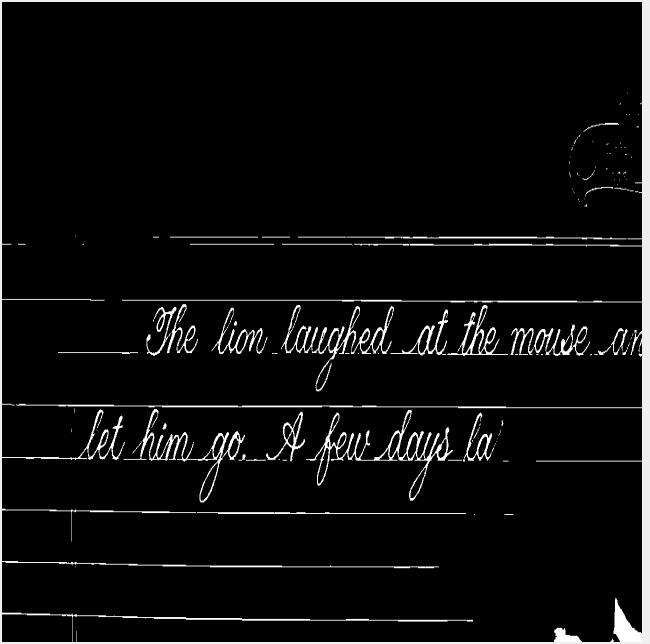 | 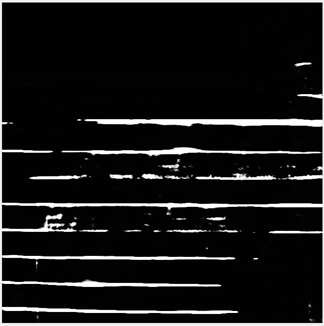 | 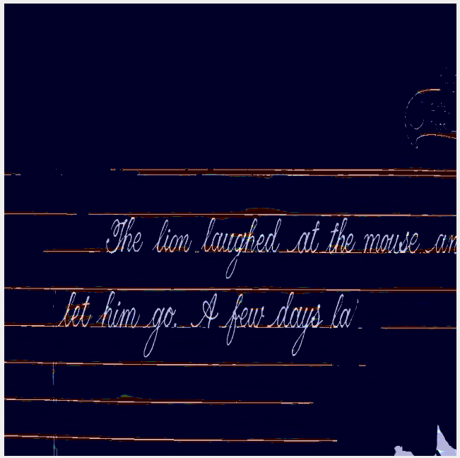
|HAND| | 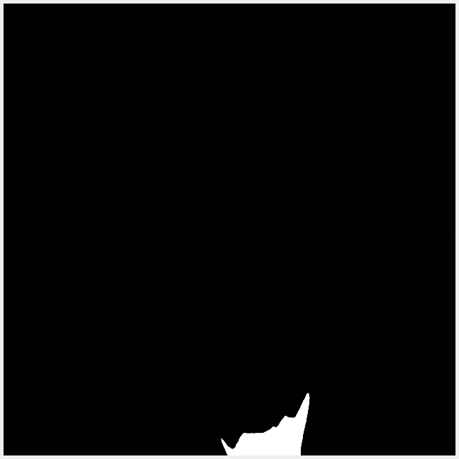 | 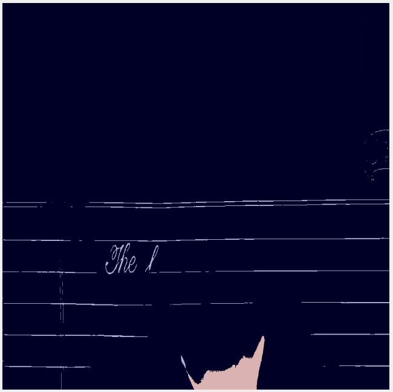
|PAGE-MARKER|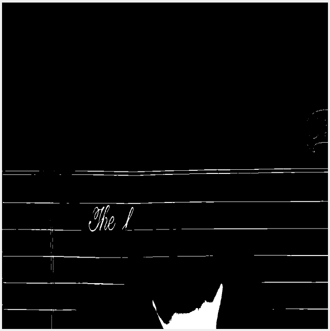 | 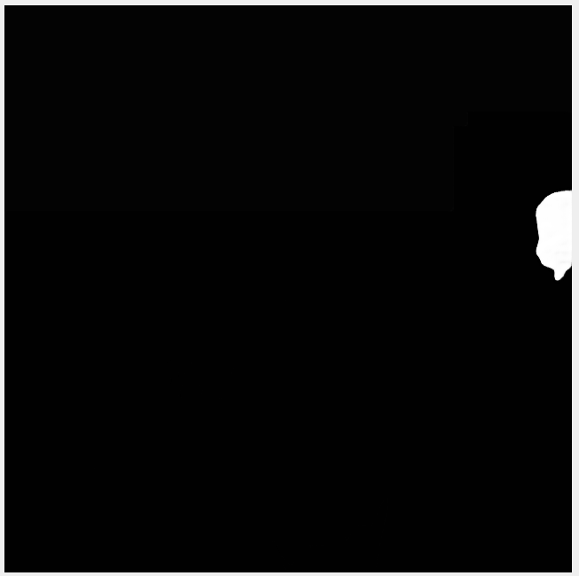 | 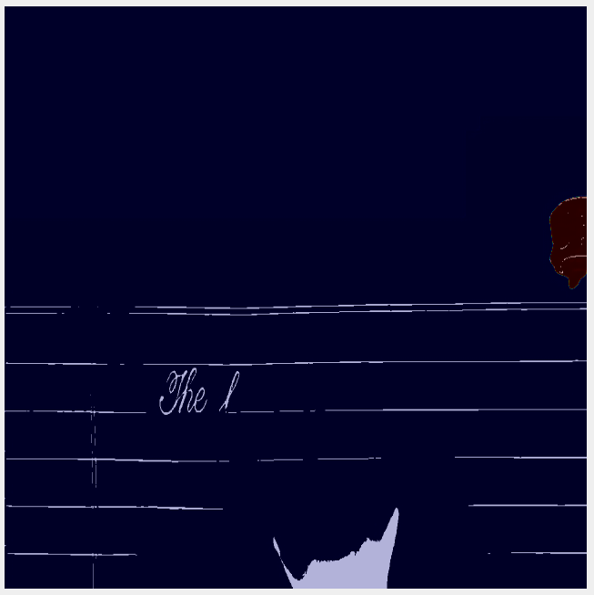
|NOT-NOISE|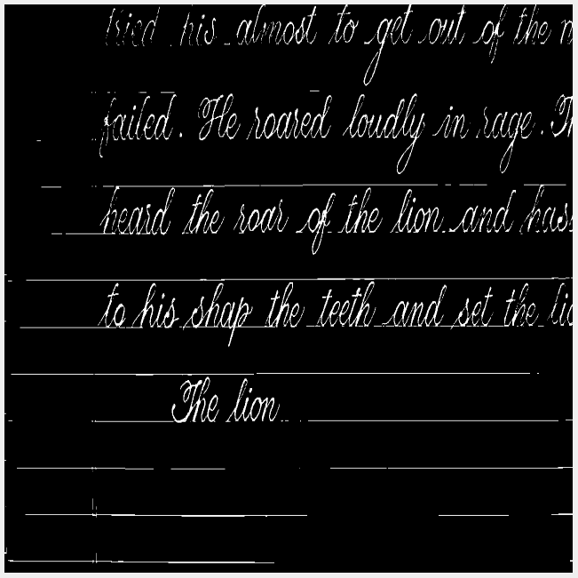 | 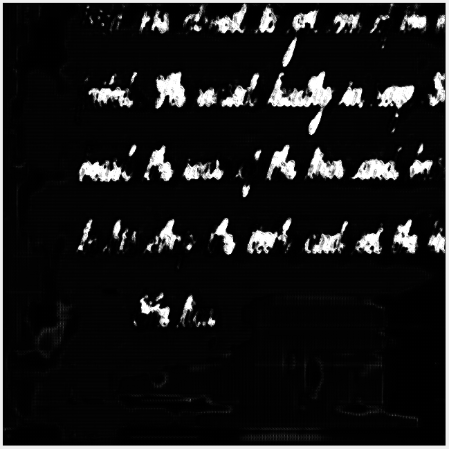 | 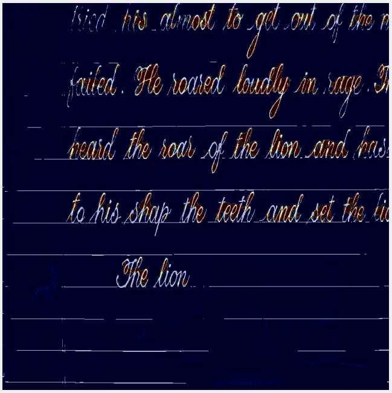

cons: [Link to the PDF contains detailed explanation of why the UNet might not work for some images](blah.pdf)