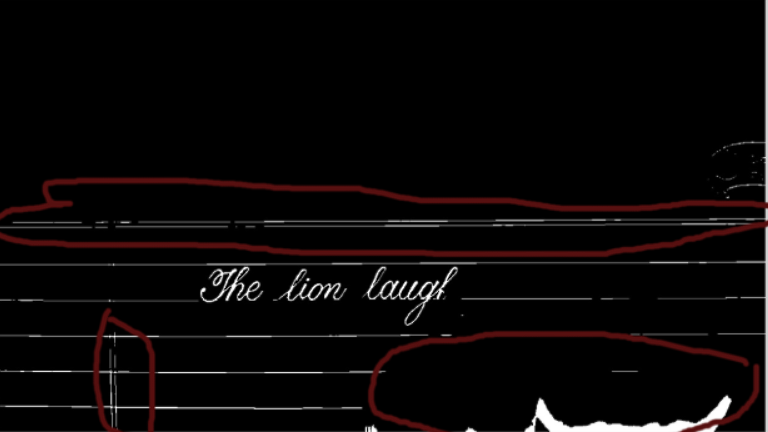

# This folder contains the code for cleaning the extra patches from the b&w video
- Example of patches

- Why these extra patches are problem?
As the labels for an image-screen-shot..t is defined as the next screen-shot's..t+1 new pixels as compared to screen-shot at t.
For such reason the generation of extra pixels from patches presents themselves as the labels